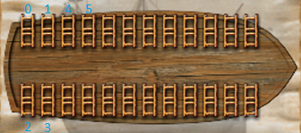

# Ship Artillery
Ship Weapons are represented by the following enum:
```rust
pub enum ShipWeaponId {
    SmallCatapult = 0x00,
    SmallBallista = 0x01,
    LargeCatapult = 0x02,
    LargeBallista = 0x03,
    Bombard = 0x04,
    Cannon = 0x05,
}
```
Cutlasses are not ship weapons.

## Ship Artillery Scaling
The amounts P3 displays in-game are not the values the game uses under the hood.
Every ship weapon has a scaling factor, through which the game divides the actual values.

A table that maps every `ShipWeaponId` to its scaling factor can be found at `0x00672CB4`.
This reveals the following factors:
```rust
ShipWeaponId::SmallCatapult => 1000
ShipWeaponId::SmallBallista => 1000
ShipWeaponId::LargeCatapult => 2000
ShipWeaponId::LargeBallista => 2000
ShipWeaponId::Bombard => 2000
ShipWeaponId::Cannon => 1000
```

## Ship Artillery Slots
A ship's artillery slots are filled with the following enum:
```c
enum ship_artillery_slot : unsigned __int8
{
  ship_artillery_slot_small_catapult = 0u,
  ship_artillery_slot_small_ballista = 1u,
  ship_artillery_slot_large_catapult = 2u,
  ship_artillery_slot_large_ballista = 3u,
  ship_artillery_slot_bombard = 4u,
  ship_artillery_slot_cannon = 5u,
  ship_artillery_slot_large_neighbor = 6u,
  ship_artillery_slot_unavailable = 7u,
  ship_artillery_slot_empty = 255u,
};
```

The slots are indexed as indicated here:
<p style="text-align:center">
    
</p>
