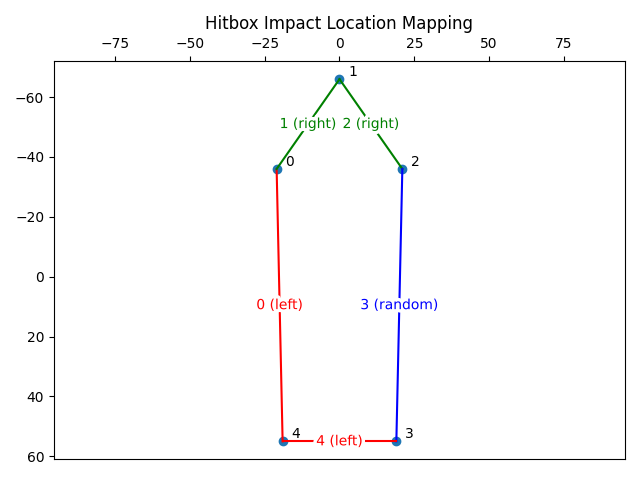
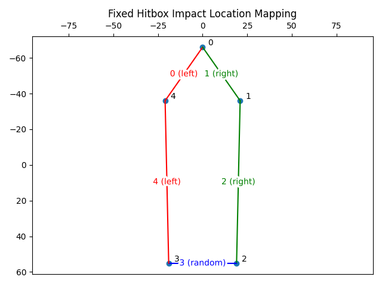

# Damage to Offside Ship Artillery

## Summary
Incoming projectiles don't always damage weapons on the correct side of the ship, because the `get_sea_battle_projectile_impact_direction` function at `0x0060A73C`, which calculates which side of the ship has been hit, is broken.

## Details
The mapping between "left", "right" and "random" sides of the ship being hit is as follows:


## Fix
To get the correct results, the shape defined in the static hitbox table at `0x0067AB30` must rotate by one point.
The old table:
```
0067AB30  ED FF  E1 FF
0067AB34  00 00  C9 FF
0067AB38  13 00  E1 FF
0067AB3C  13 00  2F 00
0067AB40  ED FF  2F 00
0067AB44  EB FF  DC FF
0067AB48  00 00  BE FF
0067AB4C  15 00  DC FF
0067AB50  13 00  37 00
0067AB54  ED FF  37 00
0067AB58  E7 FF  F2 FF
0067AB5C  00 00  CA FF
0067AB60  19 00  F2 FF
0067AB64  13 00  43 00
0067AB68  ED FF  43 00
0067AB6C  EA FF  E7 FF
0067AB70  00 00  BD FF
0067AB74  16 00  E7 FF
0067AB78  13 00  51 00
0067AB7C  ED FF  51 00
```
must be replaced with this rotated variant:
```
0067AB30  00 00  C9 FF
0067AB34  13 00  E1 FF
0067AB38  13 00  2F 00
0067AB3c  ED FF  2F 00
0067AB40  ED FF  E1 FF
0067AB44  00 00  BE FF
0067AB48  15 00  DC FF
0067AB4c  13 00  37 00
0067AB50  ED FF  37 00
0067AB54  EB FF  DC FF
0067AB58  00 00  CA FF
0067AB5c  19 00  F2 FF
0067AB60  13 00  43 00
0067AB64  ED FF  43 00
0067AB68  E7 FF  F2 FF
0067AB6c  00 00  BD FF
0067AB70  16 00  E7 FF
0067AB74  13 00  51 00
0067AB78  ED FF  51 00
0067AB7C  EA FF  E7 FF
```

This will rotate the hitbox points, and define the following (correct) impact location mapping:

