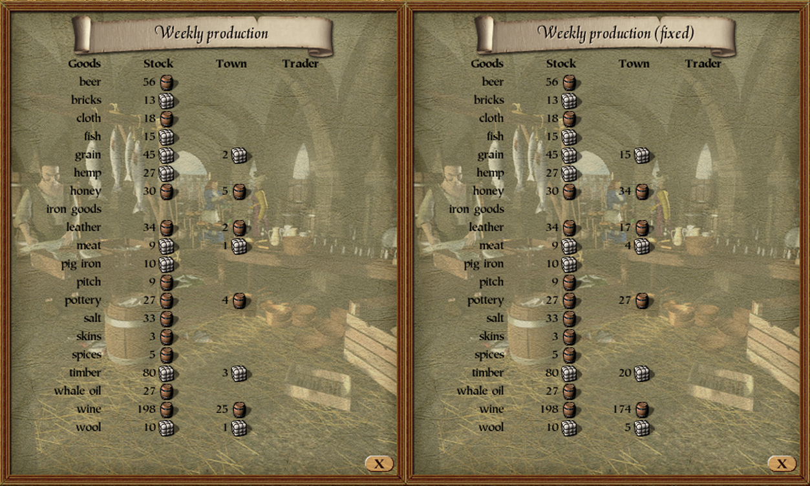

# Market Hall Production of Town Bug

## Summary
The market hall "Production" page states it displays weekly production, but in the "Town" column it displays the daily production.

## Details
The `ui_prepare_market_hall_window_production_page` function at `0x005DE960` does not multiply the daily production of towns values with `7`, as it does with merchant production.

## Fix
Replacing the two basic blocks which prepare the market hall page (`0x005DEA18` for barrel wares and `0x005DEA73` for bundle wares) with a copy that does an additional `imul` instruction solves this issue.

