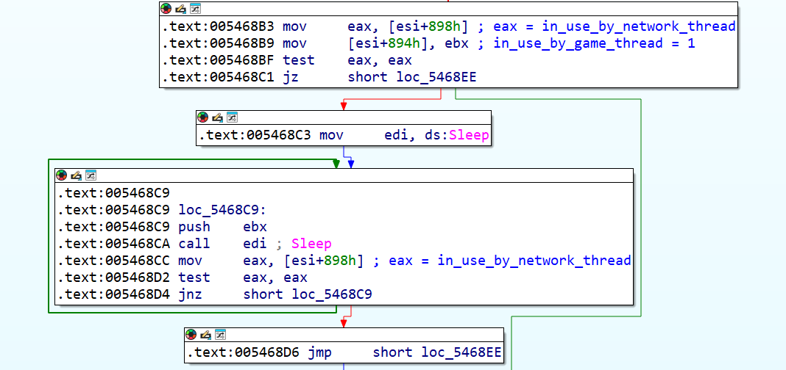
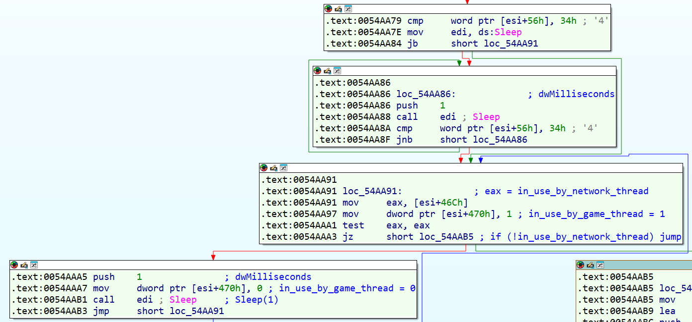
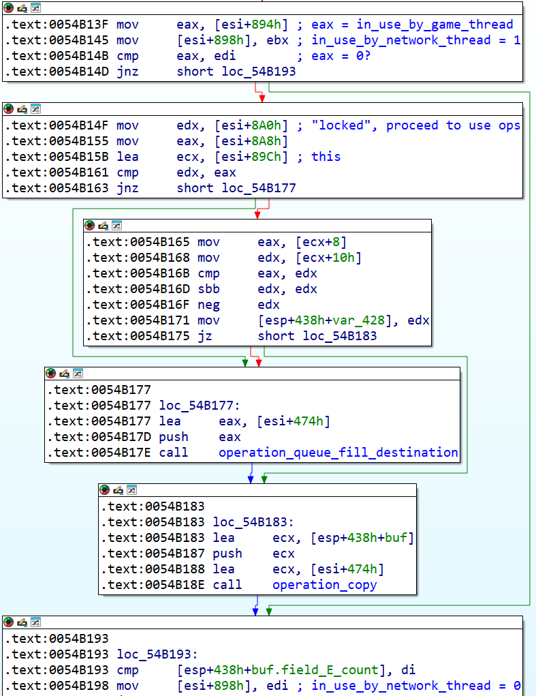
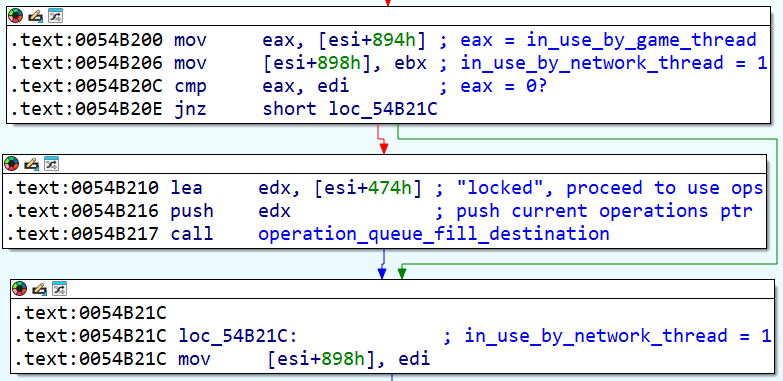
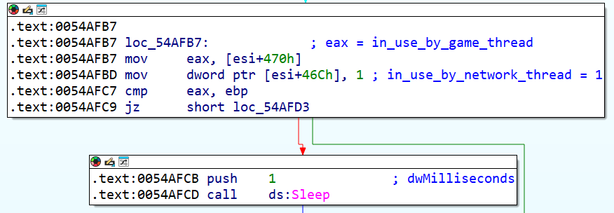
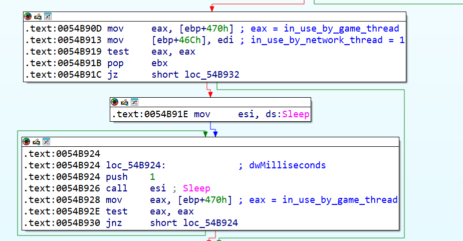
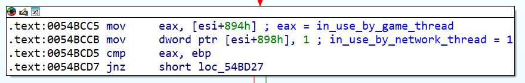

# Multiplayer Locks

## Summary
The game thread and network thread access shared data structures without proper synchronization.
These race conditions can cause operations to disappear, and that causes the game to desync.

## Details
Despite locks and even lock-free concurrent data structures being [well-understood in the mid 1980s](https://en.wikipedia.org/wiki/Treiber_stack), P3 does not use correct locks anywhere.

### Execute Current Operations
The `execute_operations` function at `0x00546870` is not locking the current operations properly.

The basic block at `0x005468B3` attempts to lock the current operations:

This is not how locks work.

### Insert Pending Operations
The `insert_into_pending_operations_warpper` function at `0054AA70` is not locking the pending operations properly.

The basic blocks at `0054AA79` attempt to lock the pending operations:

This is not now locks work.

### Client Ingress Queue
The function at `0x0054B080` which moves operations from the ingress queue and the socket into the current operations is not locking the current operations properly at two locations.

The basic block at `0x0054B13F` attempts to try-lock the current operations:

This is not how locks work.

The basic block at `0x0054B200` attempts to try-lock the current operations:

This is not how locks work.

### Client Pending Operations
The function at `0x0054AFA0` which sends operations from the pending operations to the host is not locking the current operations properly:

This is certainly not how locks work.

### Host Egress Queue
The function at `0x0054B670` which moves operations from the host's pending operations and the client sockets into the egress queue is not locking the pending operations properly:

This is not how locks work.

### Host Ingress Queue
The function at `0x0054B960` which moves operations from the host's egress and ingress queues into the current operations is not locking the current operations properly:

This is not how locks work.

## Fix
All bugs are fixed by the [fix-multiplayer-locks](https://github.com/P3Modding/p3-lib/tree/master/mod-fix-multiplayer-locks) mod.

### Execute Current Operations
To fix the problem at `0x005468B3` the following changes have to be made:
- The "locking" basic blocks at `0x005468B3` must correctly lock the current operations.
This can be achieved by inserting a call to a proper lock function.
- The "unlocking" basic block at `0x00547254` must correctly unlock the current operations.
This can be achieved by inserting a call to a proper unlock function.

### Insert Pending Operations
To fix the problem at `0x0054AA79` the following changes have to be made:
- The "locking" basic blocks at `0x0054AA79` must correctly lock the pending operations.
This can be achieved by inserting a call to a proper lock function.
- The "unlocking basic block at `0x0054AAC2` must correctly unlock the pending operations.
This can be achieved by inserting a call to a proper unlock function.

### Client Ingress Queue
To fix the problem at `0x0054B13F` the following changes have to be made:
- The "try-locking" basic block at `0x0054B13F` must correctly try-lock the current operations, and continue into the basic block at `0x0054B14F` only if the lock was acquired.
This can be achieved by replacing the two `mov` instructions with a call instruction to a proper try-lock function which returns the result.
- The "unlocking" basic block at `0x0054B198` must unlock the current operations only if they were locked by the basic block at `0x0054B13F`.
This can be achieved by replacing the `mov` instruction with a call instruction to a proper unlock function and making the `jnz` instruction target the next instruction after the call.
The `cmp` instruction above it must be moved below it to ensure it always happens, so `jnz` must point to the moved `cmp`.

To fix the problem at `0x0054B200` the following changes have to be made:
- The "try-locking" basic block at `0x0054B200` must correctly try-lock the current operations, and continue into the basic block at `0x0054B210` only if the lock was acquired.
This can be achieved by replacing the two `mov` instructions with a call instruction to a proper try-lock function which returns the result.
- The "unlocking" basic block at `0x0054B21C` must unlock the current operations only if they were locked by the basic block at `0x0054B200`.
This can be achieved by replacing the `mov` instruction with a call instruction to a proper unlock function and making the `jnz` instruction target the next instruction after the call.

### Client Pending Operations
To fix the problem at `0x0054AFB7` the following changes have to be made:
- The "locking" basic block at `0x0054AFB7` must correctly lock the pending operations.
This can be achieved by replacing the entire block and its successor with a call instruction to a proper lock function.
- The two "unlocking" branches at `0x0054B049` and `0x0054B063` must unlock the pending operations.
This can be achieved by replacing the respective `mov` instruction with a call instruction to a proper unlock function.

### Host Egress Queue
To fix the problem at `0x0054B90D` the following changes have to be made:
- The "locking" basic block at `0x0054B90D` must correctly lock the pending operations.
This can be achieved by inserting a call to a proper lock function.
- The "unlocking" instruction at `0x0x0054B949` must correctly unlock the pending operations.
This can be achieved by inserting a call to a proper unlock function.

### Host Ingress Queue
To fix the problem at `0x0054BCCB` the following changes have to be made:
- The "try-locking" basic block at `0x0054BCCB` must correctly try-lock or lock the current operations, and continue into the basic block at `0x0054BCD9` only if the lock was acquired.
This can be achieved by inserting a call to a proper lock function.
- The "unlocking" instruction at `0x0054BD2C` must correctly unlock the current operations if they were locked.
If the "try-lock" was replaced with a lock, this can be achieved by inserting a call to a proper unlock function.
