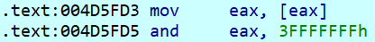

# Uncompressed Trade Route Loading

## Summary
The `decompress_packed_trade_route` function at `0x006387E0` can handle uncompressed trade routes if the output length is negative.
However, its caller fails to allocate the correct amount of memory, so the loading fails.

## Details
Instead of calculating the absolute of the output size, the output size is `and`ed with `0x3fffffff`:

For negative output sizes the result is very big, so the allocation fails, and the trade route loading is aborted.

## Fix
To fix this issue, the [correct absolute value](https://github.com/P3Modding/p3-lib/tree/master/mod-fix-uncompressed-trade-route-loading) must be calculated.
