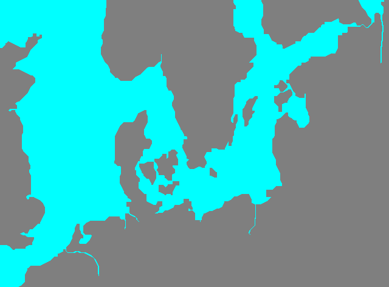

# Navigation Matrix
The vanilla navigation matrix is stored in `./navdata/nav_matrix.dat`.
The file format is defined as:
```
          | 00  01   02  03 | 04  05   06  07 |
00000000  | Height | Width  |  Data           |
00000008  | Data (cont)                       |
```
where `Width` and `Height` denote the dimensions of a matrix, and `Data` is an `u8` array of length `Width*Height`.
A value of `0x00` denotes water, a value of `0x01` denotes land.
The dimensions of the vanilla matrix are 640x472.

The following sample code converts the navigation matrix file into a png:
```python
import struct
import imageio
import numpy

f = open("nav_matrix.dat", "rb")
height = struct.unpack("<h", f.read(2))[0]
width = struct.unpack("<h", f.read(2))[0]
image = numpy.zeros((width, height, 3), dtype=numpy.uint8)

for x in range(0, width):
    for y in range(0, height):
        cell = f.read(1)
        if cell == b"\x00":
            image[x, y] = (0x00, 0xff, 0xff)
        elif cell == b"\x01":
            image[x, y] = (0x7f, 0x7f, 0x7f)
        else:
            raise Exception(f"{cell}")

imageio.imwrite("nav_matrix.png", image)
```

