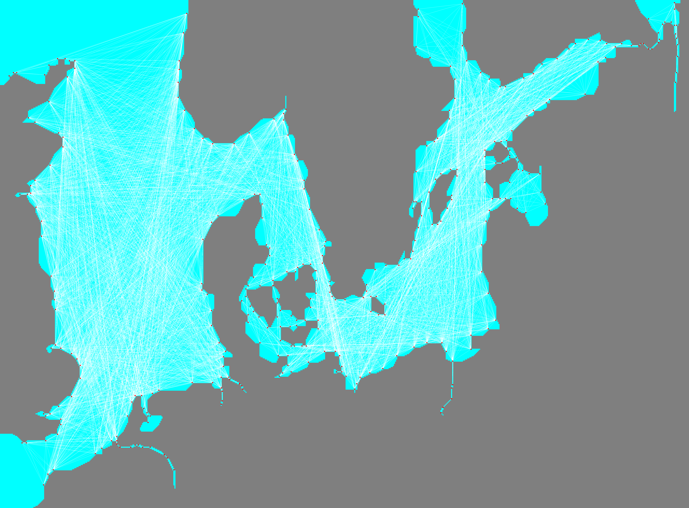

# Navpoint Matrix
The vanilla navigation matrix is stored in `./navdata/matrix_int.dat`.

The following sample code plots the direct connections:
```python
import struct
from typing import Tuple
from PIL import Image, ImageDraw

UPSCALE = 11

# Load navigation matrix
nav_matrix_file = open("nav_matrix.dat", "rb")
width, height = struct.unpack("<HH", nav_matrix_file.read(4))
print(f"{width}x{height}")
image = Image.new("RGB", (width * UPSCALE, height * UPSCALE))
draw = ImageDraw.Draw(image)
navigation_matrix: dict[Tuple[int, int], Tuple[int, int, int]] = {}
for y in range(0, height):
    for x in range(0, width):
        cell = nav_matrix_file.read(1)
        if cell == b"\x00":
            navigation_matrix[(x, y)] = (0x00, 0xFF, 0xFF)
        elif cell == b"\x01":
            navigation_matrix[(x, y)] = (0x7F, 0x7F, 0x7F)
        else:
            raise Exception(f"{cell}")

# Load navigation vector
nav_vec_file = open("nav_vec.dat", "rb")
navpoints_count = struct.unpack("<H", nav_vec_file.read(2))[0]
print(f"{navpoints_count} navpoints")
nav_vec_file.read(2)
vector: list[Tuple[int, int]] = []
for i in range(0, navpoints_count):
    x = struct.unpack("<H", nav_vec_file.read(2))[0]
    y = struct.unpack("<H", nav_vec_file.read(2))[0]
    vector.append((x, y))

# Draw navigation matrix
for (x, y), val in navigation_matrix.items():
    for xi in range(0, UPSCALE):
        for yi in range(0, UPSCALE):
            image.putpixel((x * UPSCALE + xi, y * UPSCALE + yi), val)

# Load and draw navpoint matrix
matrix_int_file = open("matrix_int.dat", "rb")
direct_connections = 0
indirect_connections = 0
for source in range(0, navpoints_count):
    for destination in range(0, navpoints_count):
        total_distance = struct.unpack("<I", matrix_int_file.read(4))[0]
        next_hop = struct.unpack("<H", matrix_int_file.read(2))[0]
        if next_hop == destination:
            x_src, y_src = vector[source]
            x_dst, y_dst = vector[destination]
            draw.line(
                [
                    (x_src * UPSCALE + UPSCALE // 2, y_src * UPSCALE + UPSCALE // 2),
                    (x_dst * UPSCALE + UPSCALE // 2, y_dst * UPSCALE + UPSCALE // 2),
                ],
                width=1,
            )
            direct_connections += 1
        else:
            indirect_connections += 1
print(
    f"{direct_connections} direct connections, {indirect_connections} indirect connections"
)

# Draw navigation vector
for x, y in vector:
    for xi in range(0, UPSCALE):
        for yi in range(0, UPSCALE):
            image.putpixel((x * UPSCALE + xi, y * UPSCALE + yi), (0xFF, 0x00, 0x00))

image.save("matrix_int.png", "PNG")
```

