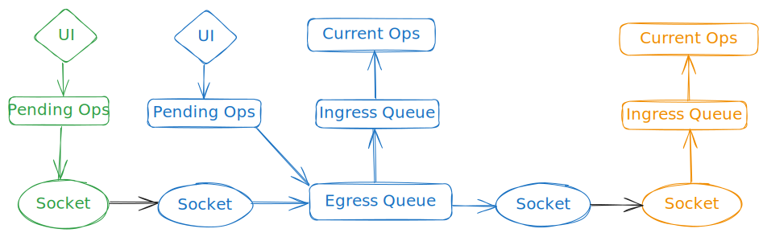

# Operation Synchronization
The following flowchart illustrates the logical path of an operation through the different P3s and data structures:

The ingress queues are skipped, if the current operations have enough free capacity.
Green denotes the sending client, blue denotes the hosting client, and orange denotes a receiving client.
The green client would receive the operation too, since the operation is sent to all connected clients.

All network operations are run by the network thread.
**The shared datastructures are guarded by a broken spinlock implementation, as discussed in the Known Bugs chapter.**

The host chooses the order of operations to guarantee consistency between all clients.
