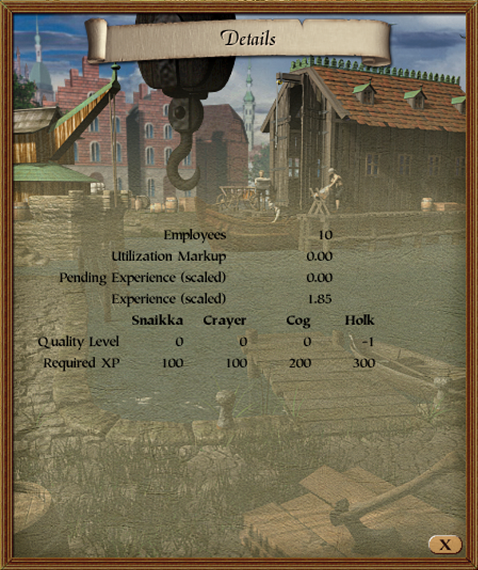

# Shipyard Details Patch

    

## Summary
This patch display's the shipyard's employees, markup and experience.

## Details
Hooks are deployed to the following locations:
- The window's `open` function (to set the window's gradient)
- The window's `render_window` function (to render additional text elements)

## Patch
The source code for this patch can be found [here](https://github.com/P3Modding/p3-lib/tree/master/mod-shipyard-details).
