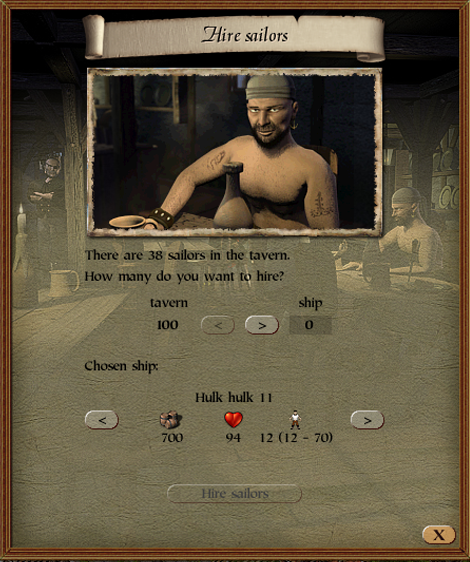

# Tavern Show All Sailors Patch
<p style="text-align:center">
    
</p>

## Summary
This patch modifies P3 to show all available sailors in the tavern's "Hire Sailors" page.

## Details
The "Hire Sailors" page displays a random amount of sailors if the sailor pool is bigger than 50.

## Patch
The comparison is at `0x005D4CD4`:
```
.text:005D4CCA                 call    get_available_sailors
.text:005D4CCF                 and     eax, 0FFh
.text:005D4CD4                 cmp     eax, 32h ; '2'
.text:005D4CD7                 mov     [esp+54h+a3], eax
.text:005D4CDB                 jle     short loc_5D4CF8
.text:005D4CDD                 fld     dword ptr [esi+1CA0h]
.text:005D4CE3                 fmul    ds:flt_672F04
.text:005D4CE9                 fadd    ds:dbl_679CA0
.text:005D4CEF                 call    __ftol
.text:005D4CF4                 mov     [esp+54h+a3], eax
.text:005D4CF8 loc_5D4CF8:
.text:005D4CF8                 cmp     [esi+1C38h], eax
```

To increase the threshold to 100, the operation `83 F8 32` has to be replaced with `83 F8 64`.
