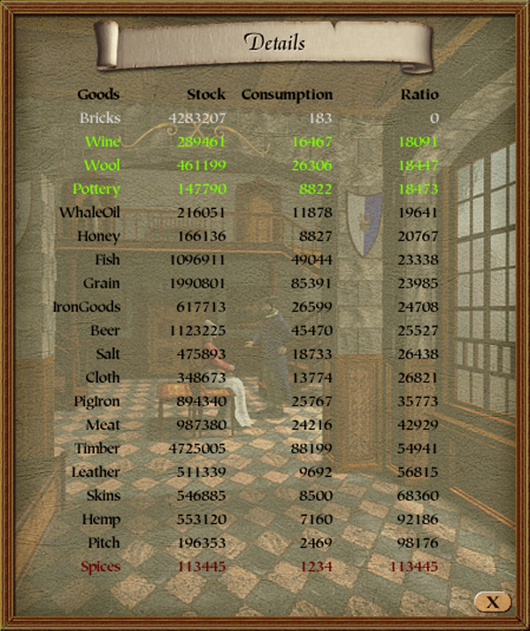
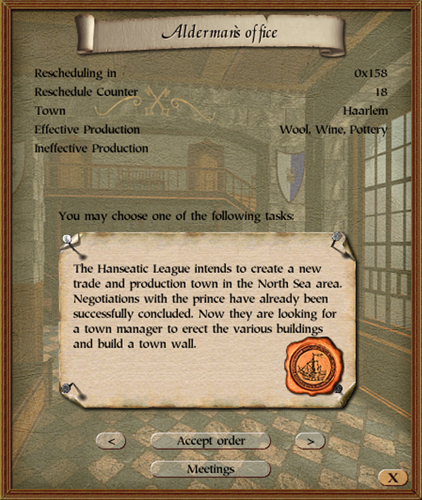

# Town Hall Details Patch

    
    

## Summary
This patch display's the hanseatic stock/consumption ratios used to determine town and effective production, and shows details about the alderman missions on offer.

## Details
Hooks are deployed to the following locations:
- The window's `open` function (to set the window's background color gradient)
- The sidepanel's `set_selected_page` function (to set the window's background color gradient)
- The window's `render_window` function (to render additional text elements)

## Patch
The source code for this patch can be found [here](https://github.com/P3Modding/p3-lib/tree/master/mod-town-hall-details).
