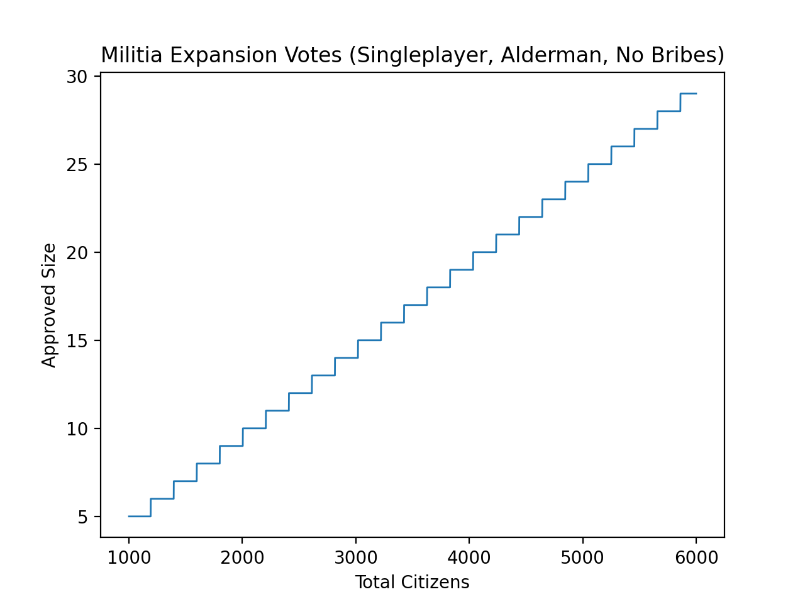

# Council Meeting
The `handle_st_2e_council_meeting` function at `0x004E9A94` handles the entire council meeting voting process by rescheduling itself multiple times.

```c
struct scheduled_task_2e_council_meeting
{
  signed __int32 field_0_extra_tax_amount;
  unsigned __int8 field_4_town_index;
  council_meeting_type field_5_meeting_type;
  char field_6_pending_yes;
  char field_7_pending_no;
  unsigned __int8 field_8_yes;
  unsigned __int8 field_9_no;
  char field_A_maybe_abstain;
  unsigned __int8 field_B_player_vote_bitmask;
  signed __int16 field_C_tax_per_head_amount;
  char field_E_merchant_index;
  char field_F;
};
```

## First Execution
On the first tick of the day (and thus the first tick of the meeting), the task is initialized:
- `pending_no` is set to `22`.
- `pending_no` is decreased by `1` for every bribed councillor.
- For every player merchant:
    - If the merchant is a councillor or higher, a notification is sent to the player.
    - `pending_no` is decreased by `1` for a councillor, by `2` for a patrician and mayor, and by `3` for an alderman.
- Should `pending_no` be smaller than `4`, it is set to `4`.

Afterwards the offer-specific votes in favour are determined, and the task is rescheduled at 4 ticks in the future.

### Extra Tax
TODO

### Enlarge Town Walls
TODO

### Expand Military
The expand military voting behaviour is calculated as follows:
```python
if town.is_under_siege():
    total_citizens *= 2

t = 512 - 203 * town.approved_militia_size + total_citizens
if t < 100:
    pending_yes = pending_no // 10
elif t <= 920:
    pending_yes = pending_no * t // 256
else:
    pending_yes = 9 * pending_no // 10

pending_no -= pending_yes
```

This causes the following relationship of citizens and military size:


### Change Tax per Head
TODO

## Subsequent Executions
If `pending_no` and `pending_yes` are bigger than `0`, the yes vote count is increased if the following formula is true:
```python
yes + 3 * pending_yes <= no + 3 * pending_no
```
Otherwise the no vote count is increased.

If only one of `pending_no` and `pending_yes` is bigger than `0`, the corresponding vote count is increased.

If both `pending_no` and `pending_yes` are `0`, no vote count is increased.

If the least significant byte of the timestamp is smaller than `0xDC`, the scheduled task is rescheduled at 4 ticks in the future.
Otherwise the task is rescheduled at the next tick.


## Final Execution and Result
During the execution of the task on the first tick of the following day the result of the ballot is determined and applied.

### Extra Tax
TODO

### Enlarge Town Walls
TODO

### Expand Military
If the town's old approved military size is below `0x8000`, it is increased by `10`.

### Change Tax per Head
TODO
