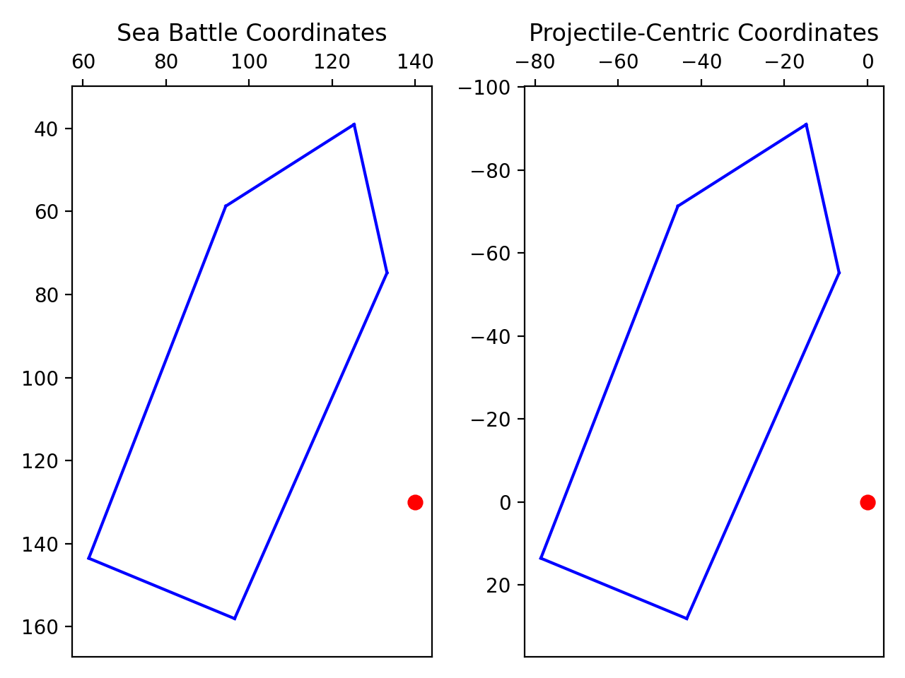
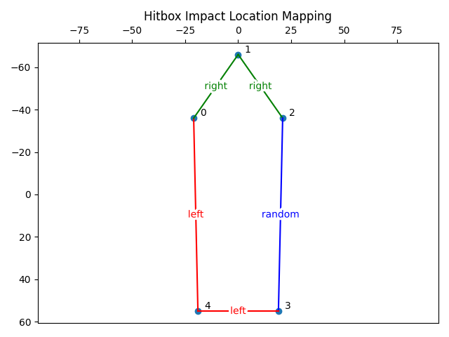

# Hitboxes
Hitboxes are defined in a static ship hitbox table at `0x0067AB30`:

|Ship|Point 0|Point 1|Point 2|Point 3|Point 4|
|-|-|-|-|-|-|
|Snaikka|(-19, -31)|(0, -55)|(19, -31)|(19, 47)|(-19, 47)|
|Crayer|(-21, -36)|(0, -66)|(21, -36)|(19, 55)|(-19, 55)|
|Cog|(-25, -14)|(0, -54)|(25, -14)|(19, 67)|(-19, 67)|
|Hulk|(-22, -25)|(0, -67)|(22, -25)|(19, 81)|(-19, 81)|

It creates the following shapes of ships facing north:


## Projectile Collisions
The `get_sea_battle_projectile_impact_direction` function at `0x0060A73C` determines whether and where a ship is hit by a projectile.

First it rotates the ship's hitbox coordinates (in its own coordinate space, i.e. [around its origin](https://en.wikipedia.org/wiki/Rotation_matrix)). Since the ship's direction rotates clockwise and the Y-axis is inverted, the formula for counter-clockwise rotation can be used:
\\[x_{hitbox}' = x_{hitbox} * cos(a) - y_{hitbox} * sin(a)\\]
\\[y_{hitbox}' = x_{hitbox} * sin(a) + y_{hitbox} * cos(a)\\]

Then it adds the rotated hitbox coordinates to the ship coordinates, and transforms them into a projectile-centric space:
\\[x_{hitbox}'' = x_{ship} + x_{hitbox}'' - x_{projectile}\\]
\\[y_{hitbox}'' = y_{ship} + y_{hitbox}'' - y_{projectile}\\]



Finally it calculates the intersection (if any) of all ship hitbox lines and the line from the projectile's current position to its future position at the next tick, and decides whether the ship was hit on the port, starboard or a random side.

## Impact Location
The `get_sea_battle_projectile_impact_direction` function returns the calculated impact location:
```c
enum impact_location : __int8
{
    impact_location_none   = 0x0,
    impact_location_left   = 0x1,
    impact_location_right  = 0x2,
    impact_location_random = 0x3,
};
```
Should a projectile intersect hitbox lines with different associated impact locations, the result is set to random.
The jump table at `0x0060AD69` maps intersections of the projectile's path with the ship's hitbox lines to impact locations:

|Intersected Line|Location|
|-|-|
|Point 4 to Point 0|Left|
|Point 3 to Point 4|Left|
|Point 0 to Point 1|Right|
|Point 1 to Point 2|Right|
|Point 2 to Point 3|Random|

This defines the following line-to-location mapping:


**The mapping is incorrect, as discussed in the Known Bugs chapter.**
