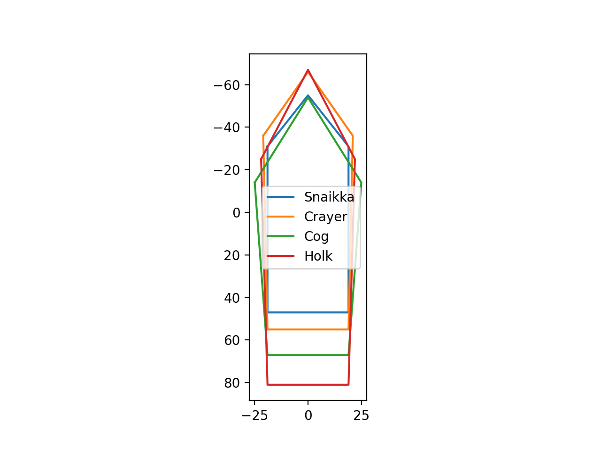

# Hitboxes

Hitboxes are defined in a static table at `0x0067AB30`:

|Ship|Point 0|Point 1|Point 2|Point 3|Point 4|
|-|-|-|-|-|-|
|Snaikka|(-19, -31)|(0, -55)|(19, -31)|(19, 47)|(-19, 47)|
|Crayer|(-21, -36)|(0, -66)|(21, -36)|(19, 55)|(-19, 55)|
|Cog|(-25, -14)|(0, -54)|(25, -14)|(19, 67)|(-19, 67)|
|Hulk|(-22, -25)|(0, -67)|(22, -25)|(19, 81)|(-19, 81)|

It creates the following shapes:

