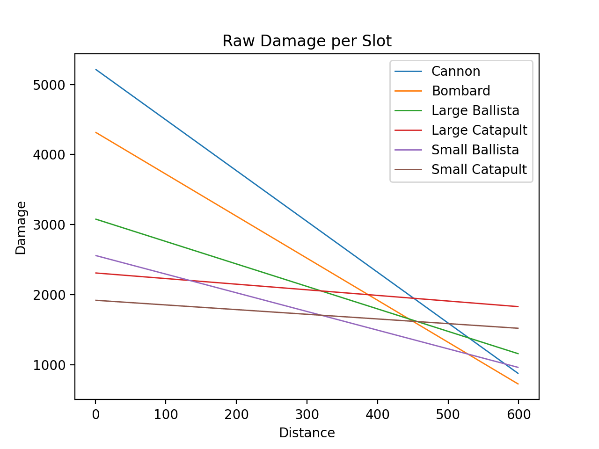
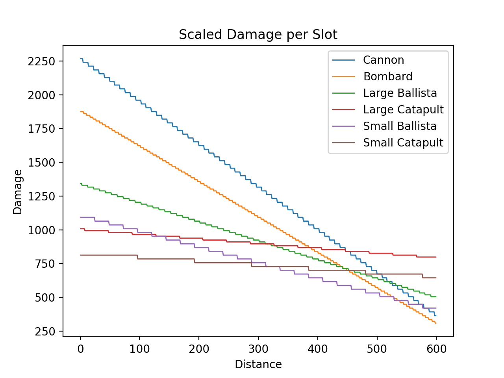
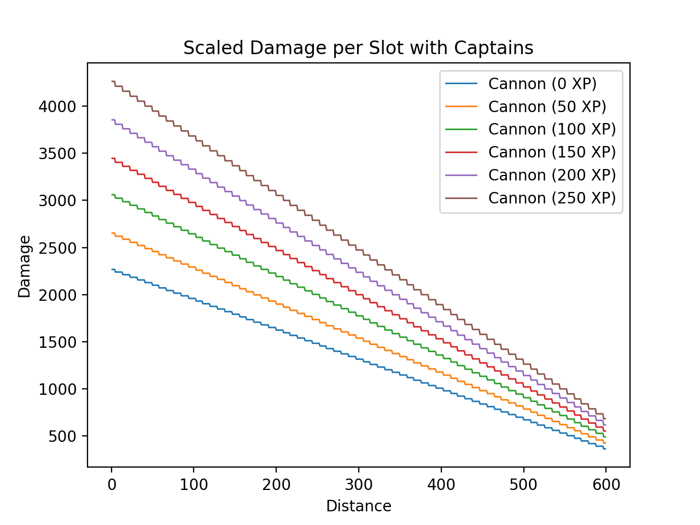

# Projectiles

## Ship Artillery Projectiles
The `sea_battle_local_map_ship_fire_volley` function at `0x0061E8EF` loops over the artillery slots of the selected side.
It restricts the target coordinates to be in the cone of fire, and calls `sea_battle_local_map_ship_fire_shot` at `0x006214CB` for every artillery piece.
The code for all plots can be found in the source code of this book.

### Raw Damage
The *raw damage* of all projectiles of a volley is controlled through 3 tables in the `sea_battle_local_map_ship_fire_volley` function: Damage Component 1 at `0x00672CC0`, Damage Component 2 at `0x00672CD0`, and Damage Reduction at `0x00672CE4`.
The vanilla values are shown in the following table:

|Artillery Type|Damage 1|Damage 2|Damage Reduction|
|-|-|-|-|
|Small Catapult|32|60|480|
|Small Ballista|32|80|160|
|Large Catapult|77|60|480|
|Large Ballista|77|80|160|
|Bombard|96|90|120|
|Cannon|58|90|120|

The formula of the raw damage is as follows:
```python
def calc_raw_damage(distance: int, artillery_type: int):
    return max(0, distance \
            * damage1[artillery_type] \
            * damage2[artillery_type] \
            // (-6 * reduction[artillery_type]) \
        + \
            damage1[artillery_type] \
            * damage2[artillery_type])
```
The following image shows the plot of raw damage and distance, with the damage values of double slot weapons adjusted by `0.5`.


While every individual projectile is subject to minor source and destination adjustments, the distance raw damage calculation is done once for the entire volley.

### Scaling
The raw damage is scaled linearly in the `sea_battle_local_map_ship_fire_shot` function at `0x006214CB`:
```python
def calc_scaled_damage(raw_damage: int):
    return 2800 * (raw_damage // 64) // 100
```

The precision loss caused by the division by 64 has a slight effect on the granularity:


While the function is called for every individual projectile, this calculation will yield the same values for every projectile of a volley.

### Captain
Then the function uses the captain's combat experience (a value between `0` for a combat level `0` and `250` for a combat level `5` captain) to increase the damage:

```python
def apply_captain_factor(scaled_damage: int, combat_experience: int):
    if not combat_experience:
        return scaled_damage
    else:
        return scaled_damage * (6 * combat_experience // 17 + 100) // 100
```
This factor is roughly (ignoring precision loss through divisions) equivalent to \\(\frac{3 * combat\\_experience}{850} + 1\\) or \\(0.17647058823 * combat\\_level + 1\\).
The following figure highlights the impact of a captain on a projectile's damage:


While the function is called for every individual projectile, this calculation will yield the same values for every projectile of a volley.

### Difficulty and Maintenance
Then the function considers sea battle difficulty setting and the ship's current maintenance value to affect the damage as follows:
```python
def apply_difficulty_and_maintenance(
    damage: int, difficulty: int, ship_maintenance: int, is_ai: bool
):
    f = min(4, max(ship_maintenance >> 8, 0))
    if not is_ai:
        match difficulty:
            case 0:  # Easy
                f += 2
            case 2:  # Hard
                f -= 2
    if f > 0:
        return damage + damage * (f - 2) // 20
    else:
        return damage + damage * (f - 1) // 20
```
Since `f` cannot exceed `6`, the bonus damage from difficulty and maintenance will not exceed \\(\frac{1}{5} * damage \\).

While the function is called for every individual projectile, this calculation will yield the same values for every projectile of a volley.

### Normal Distribution and Minimum
Then the function applies a factor with a discrete uniform (assuming the sea battle's PRNG works as intended) distribution in the discrete (up to the second decimal point) interval from `0.85` to `1.15`, and enforces a minimum damage of `1`:
```python
# Discrete distribution
damage = damage * (battle_rand() % 31 + 85) // 100

# Minimum
damage = max(damage, 1)
```

### Final Scaling
Finally the `init_sea_battle_projectile` function at `0x00602A90` multiplies the damage by `1.5`, and stores the final damage in the projectile.
