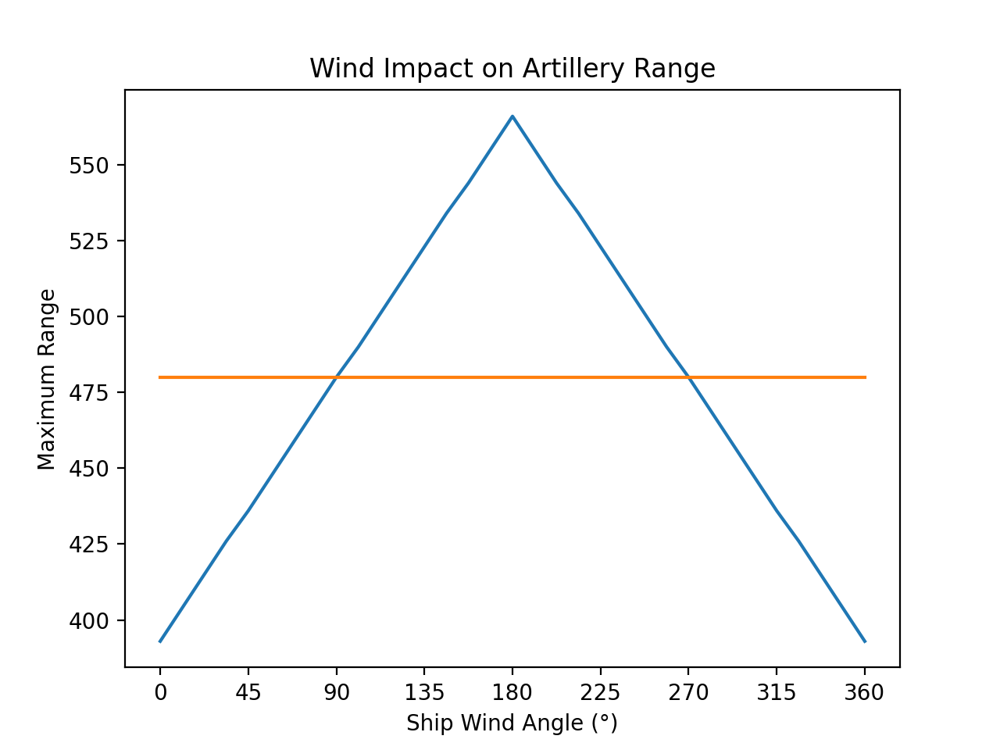

# Range
A projectile's range is calculated in `battle_projectile_calcs` at `0x0061E8EF`.
It depends only the *ship's* relative angle to the wind at the time of firing, and disregards the relative angle of the projectile to the wind.
The formula is defined as:

```python
def calc_max_distance(ship_direction: int, wind_direction: int):
    relative_angle = wind_direction - ship_direction
    if relative_angle >= 0x80:
        bonus_range_factor = 0xc0 - relative_angle
    else:
        bonus_range_factor = relative_angle - 0x40
    
    return bonus_range_factor * 4320 // 3200 + 480
```

It causes the following range spread:


The following screenshots showcase the impact of 0°, 90°, 180° and 270°:

