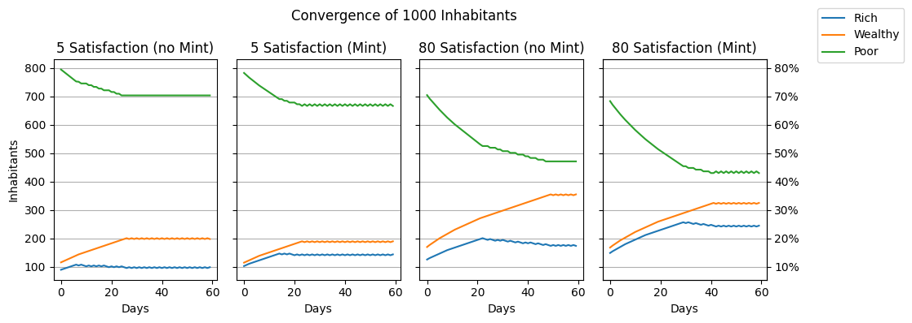

# Levels
The `town_update_population_levels` function at `0x0051C650` determines how many citizens are promoted and demoted and how many poor citizens emigrate.

The following pseudocode denotes the calculation:
```python
class Town:
    citizens: list[int]
    satisfactions: list[int]
    has_mint: bool
    dwellings_capacity: list[int]

    def __init__(
        self,
        rich: int,
        wealthy: int,
        poor: int,
        satifsaction_rich: int,
        satisfaction_wealthy: int,
        satisfaction_poor: int,
        has_mint: bool = False,
        dwellings_capacity_rich: int = 999999,
        dwellings_capacity_wealthy: int = 999999,
        dwellings_capacity_poor: int = 999999,
    ):
        self.citizens = [rich, wealthy, poor]
        self.satisfactions = [
            satifsaction_rich,
            satisfaction_wealthy,
            satisfaction_poor,
        ]
        self.has_mint = has_mint
        self.dwellings_capacity = [
            dwellings_capacity_rich,
            dwellings_capacity_wealthy,
            dwellings_capacity_poor,
        ]

    def update_population_levels(self):
        self.update_population_level(0)
        self.update_population_level(1)
        # TODO poor emigration

    def update_population_level(self, level: int):
        target = (
            self.citizens[2]
            * (self.satisfactions[level] + 40)
            // self.get_divisor(level)
        )
        target = min(max(target, 1), self.dwellings_capacity[level])
        LOGGER.debug(f"{level} target: {target} stock: {self.citizens[level]}")
        if target < self.citizens[level]:
            # Current stock exceeds target
            demoted = 2 * self.citizens[level] // target + 1
            if demoted > self.citizens[level]:
                demoted = self.citizens[level] - 1
            self.citizens[2] += demoted
            self.citizens[level] -= demoted
        else:
            # Target exceeds current stock
            if self.citizens[level]:
                promoted = 2 * target // self.citizens[level] + 1
            else:
                promoted = 1  # Avoid division by zero
            if self.citizens[2] > promoted:
                LOGGER.debug(f"promoting {promoted} poors to {level}")
                self.citizens[2] -= promoted
                self.citizens[level] += promoted

    def get_divisor(self, level):
        if level == 0:
            return 213 if self.has_mint else 320
        elif level == 1:
            return 160
        raise Exception()
```

For a fixed number of total inhabitants and satisfactions, the groups converge:

