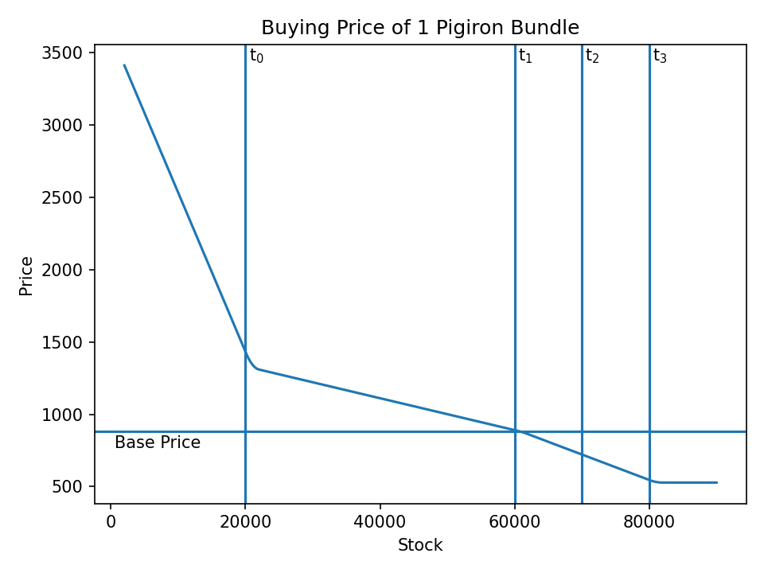

# Buy Price
The `get_buy_price` function at `0x0052E430` takes a ware, town, and buy amount and returns the transaction price.

## Formula
The price formula operates on 5 intervals, and the 4 price thresholds specify the bounds.

|Interval|Bounds|
|-|-|
|0|[0; \\(t\_0\\)]|
|1|[\\(t\_0\\); \\(t\_1\\)]|
|2|[\\(t\_1\\); \\(t\_2\\)]|
|3|[\\(t\_2\\); \\(t\_3\\)]|
|4|[\\(t\_3\\); \\(\infty\\)]|

Within every interval \\(i\\) the price \\(p\_i\\) is defined as:
\\[
\begin{aligned}
    p\_{i} &= p\_{base} * w\_{i} * f\_{i}
\end{aligned}
\\]

where \\(w\_i\\) is the amount being bought from \\(i\\) and \\(f\\) is defined as:
\\[
\begin{aligned}
    f\_4 &= 0.6\\\\
    f_{i} &=  m_i - v_i \underbrace{\frac{w\_{relative\\_stock} - w\_{relative\\_remain}}{2 * \text{interval_width}}}\_{\in [0; 1]}
\end{aligned}
\\]

where \\(w\_{relative\\_stock}\\) and \\(w\_{relative\\_remain}\\) are the stock's and remainder's offsets in the interval and \\(m\_i\\) and \\(v\_i\\) are defined as:

|Bracket|\\(m\_i\\)|\\(v\_i\\)|
|-|-|-|
|0|4|2.5|
|1|1.5|0.5|
|2|1.0|0.2|
|3|0.8|0.2|

## Example
Let's assume we buy pig iron from a town with the following thresholds:

|Threshold|Value|
|-|-|
|t0|20000|
|t1|60000|
|t2|70000|
|t3|80000|

If we buy one bundle (2000), the resulting prices at different stock levels would be:

