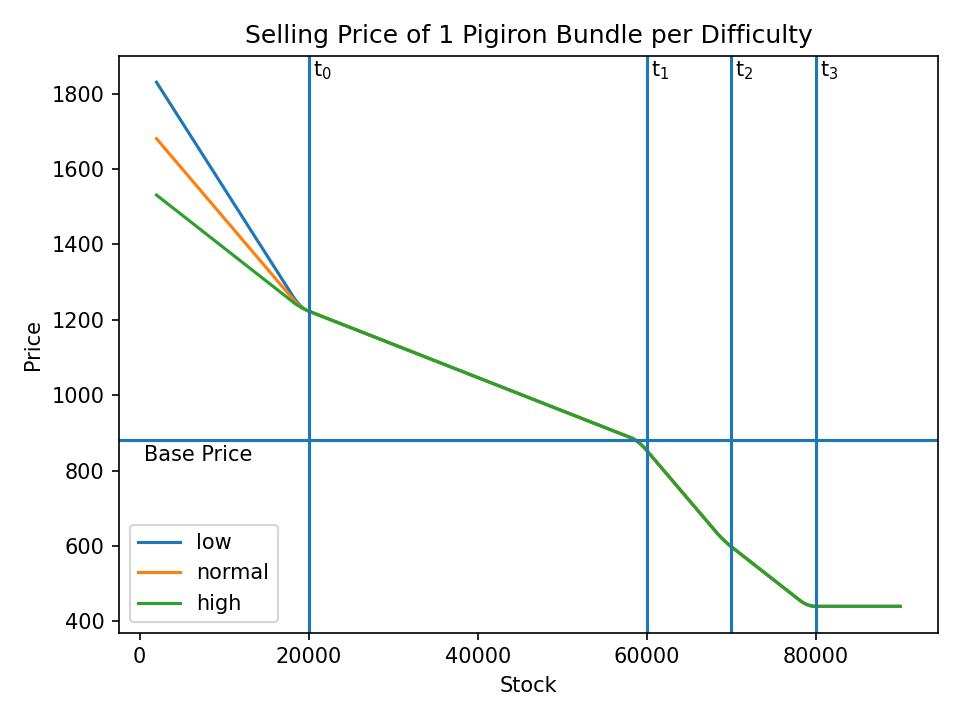

# Selling Price
The `get_sell_price` function at `0x0052E1D0` takes a pointer to a class containing the mapped trade difficulty setting, a ware, town, and sell amount and returns the transaction price.

## Formula
The price formula operates on 5 intervals, and the 4 price thresholds specify the bounds.

|Interval|Bounds|
|-|-|
|0|[0; \\(t\_0\\)]|
|1|[\\(t\_0\\); \\(t\_1\\)]|
|2|[\\(t\_1\\); \\(t\_2\\)]|
|3|[\\(t\_2\\); \\(t\_3\\)]|
|4|[\\(t\_3\\); \\(\infty\\)]|

Within every interval \\(i\\) the price \\(p\_i\\) is defined as:
\\[
\begin{aligned}
    p\_{i} &= p\_{base} * w\_{i} * f\_{i}
\end{aligned}
\\]

where \\(w\_i\\) is the amount being sold to \\(i\\) and \\(f\\) is defined as:
\\[
\begin{aligned}
    f\_4 &= 0.5\\\\
    f\_{i} &=  m_i - v_i \underbrace{\frac{w\_{relative\\_stock} + w\_{relative\\_new\\_stock}}{2 * \text{interval_width}}}\_{\in [0; 1]}\\\\
    f\_0 &=  d\_{trade\\_difficulty} - (d\_{trade\\_difficulty} - v\_i) \underbrace{\frac{w\_{relative\\_stock} + w\_{relative\\_new\\_stock}}{2 * \text{interval_width}}}\_{\in [0; 1]}
\end{aligned}
\\]

where \\(w\_{relative\\_stock}\\) and \\(w\_{relative\\_new\\_stock}\\) are the stock's and new stock's offsets in the interval and \\(m\_i\\) and \\(v\_i\\) are defined as:

|Bracket|\\(m\_i\\)|\\(v\_i\\)|
|-|-|-|
|0|NaN|1.4|
|1|1.4|0.4|
|2|1.0|0.3|
|3|0.7|0.2|

and \\(d\_{trade\\_difficulty}\\) is defined as:

|Difficulty|Value|
|-|-|
|0 (low)|2.2|
|1 (normal)|2.0|
|2 (high)|1.8|

## Example
Let's assume we sell pig iron to a town with the following thresholds:

|Threshold|Value|
|-|-|
|t0|20000|
|t1|60000|
|t2|70000|
|t3|80000|

If we sell one bundle (2000), the resulting prices at different stock levels would be:

